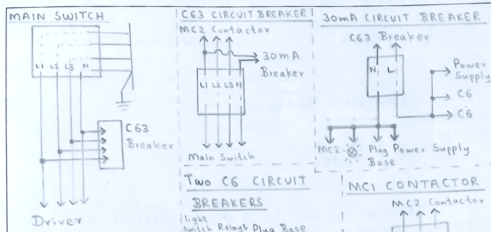
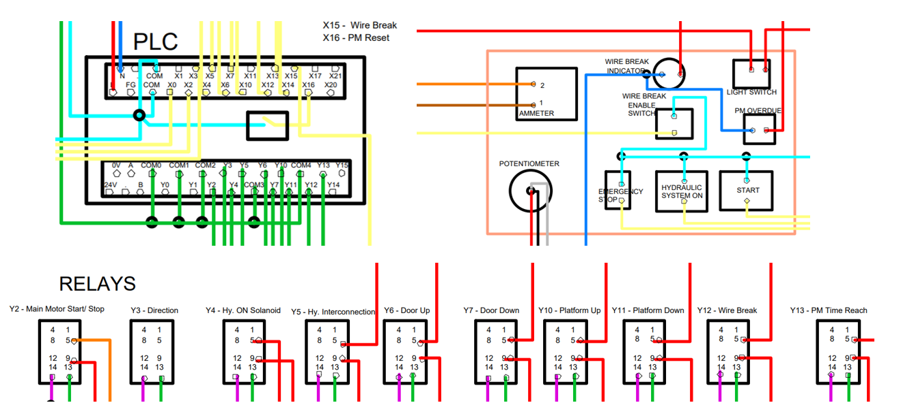
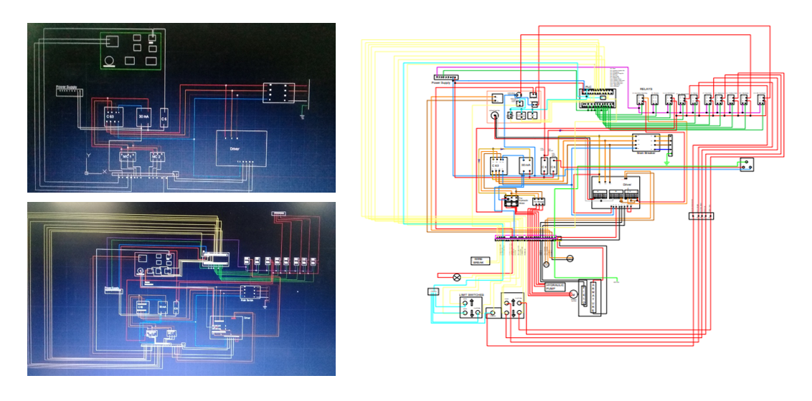

# Buncher Machine Panel Block Diagram
Redesigned Power Distribution Block Diagram for Buncher Machine Panel (Internship Project)

---

## 🔎 Overview
During my internship at Cable Solutions (Pvt) Ltd. in 2019, I was assigned my first technical project: create a complete **power distribution block diagram** for a redesigning buncher machine panel board.  

At the time, I didn’t have access to specialized electrical CAD tools, so I manually created all block diagrams using AutoCAD for over **30 components**.

---

## 📌 Project Highlights
- Manual creation of all blocks and connections in AutoCAD
- **Traced each component path carefully and assembled the diagram component by component** during troubleshooting to ensure accuracy
- Update the diagram for changes during troubleshooting and system updates

> **Note:** The complete block diagram is intentionally zoomed out to avoid revealing any sensitive or proprietary details.

---

## 📑 Lessons Learned
- Importance of detailed tracing and accuracy in electrical diagrams
- Flexibility to update designs in response to real-world changes
- Hands-on experience with AutoCAD for complex electrical layouts

---

## 🛠 Tools & Software Used
- **CAD Software:** AutoCAD

---

## 🎯 Skills
- AutoCAD (Manual Electrical Drafting)
- Electrical Schematic Design
- Troubleshooting & Layout Updating
- Component Tracing and Documentation

---

## 📬 Contact
If you have feedback or suggestions, feel free to [open an issue](https://github.com).

---
